#  SpiceHeritage – Pickle E-Commerce Website  
  
  
  
  
 


[](https://spiceheritage-brahmareddy.onrender.com/)

## 📑 Table of Contents
- [✨ Features](#-features)
- [🏗 Tech Stack](#-tech-stack)
- [⚡ Architecture](#-architecture)
- [🗄 ER Diagram](#-spice-heritage-er-diagram)
- [📸 Screenshots](#-screenshots)
- [⚙️ Setup / Installation](https://github.com/brahma2242p/spiceheritage-BrahmaReddy/tree/main?tab=readme-ov-file#%EF%B8%8F-setup-installation)
- [🤝 Contribution Guidelines](#-contributing)
- [📬 Contact](#-contact)


A full-stack **pickle e-commerce platform** built with ❤️ using **Java, JSP, Servlets, Oracle/PostgreSQL, HTML, CSS, JavaScript, and Firebase OTP authentication**.  
---
## ✨ Features  
### 👤 User Side  
- 🔑 Login/Register/Forgot Password Pages.  
- 📂 **Pickle Catalog** with dynamic product loading.  
- 🛒 **Cart & Checkout** with up to **3 saved addresses**.  
- 📑 **My Orders** with complete order history (items, prices, address).  
- 📝 Profile & address management (edit, update).  
### 🛠 Admin Side  
- 🔐 Secure **Admin Login** with session management.  
- 📊 Dashboard with:  
  - 👥 User registration details.  
  - 📦 Add / Remove Products.  
  - 🛒 Orders list for all users.  
  - 💬 Suggestions & contact form inputs.  
  - 📈 Sales Dashboard with analytics.  
---
## 🏗 Tech Stack  
**Frontend:**  
- HTML5, CSS3, Vanilla JavaScript  
**Backend:**  
- Java, JSP, Servlets (Jakarta) 
**Database:**  
- Oracle SQL (local dev)  
- PostgreSQL (Render / Supabase deployment)  
**Authentication:**  
- Firebase OTP (Under Development )
**Deployment:**  
- SupaBase (PostgreSQl Database)
- Render Cloud (war deployment)  
---
## ⚡ Architecture  
```mermaid
flowchart LR
    User[👤 User] <-->|Browser| HTML[HTML Pages]
    HTML<--> Servlet[Java Servlets]
    Servlet <--> DB[(PostgreSQL / Oracle DB)]
    Admin[🛠 Admin] <--> |Browser| AdminPages[Admin Pages]
    AdminPages<--> Servlet[Java Servlets]
````
## 🗄 Spice Heritage ER Diagram
```mermaid
classDiagram
    %% Users table
    class USERS {
        +user_id PK
        full_name
        mobile_number UNIQUE
        email UNIQUE
        password_hash
        registration_date
    }
    %% Addresses table
    class ADDRESSES {
        +address_id PK
        user_id FK
        full_name
        address_line1
        address_line2
        city
        state
        pincode
        mobile_number
    }
    %% Products table
    class PRODUCTS {
        +id PK
        name
        description
        category
        spice_level
        price_per_gram
        image_blob
        is_popular
    }
    %% Orders table
    class ORDERS {
        +order_id PK
        user_id FK
        total_amount
        shipping_full_name
        shipping_address_line1
        shipping_address_line2
        shipping_city
        shipping_state
        shipping_pincode
        shipping_mobile_number
        order_date
        order_status
    }
    %% Order Items table
    class ORDER_ITEMS {
        +order_item_id PK
        order_id FK
        product_id FK
        quantity
        price_per_gram
        weight_grams
    }
    %% Admins table
    class ADMINS {
        +admin_id PK
        username UNIQUE
        password_hash
    }
    %% Relationships
    USERS "1" --> "0..*" ADDRESSES : has
    USERS "1" --> "0..*" ORDERS : places
    ORDERS "1" --> "0..*" ORDER_ITEMS : contains
    ORDER_ITEMS "*" --> "1" PRODUCTS : references
```
Cardinal Notation

    USERS "1" --> "0..*" ADDRESSES : has
    
    USERS "1" --> "0..*" ORDERS : places 
    
    ORDERS "1" --> "1..*" ORDER_ITEMS : contains 
    
    ORDER_ITEMS "*" --> "1" PRODUCTS : references 

## 📸 Screenshots

### 🏠 Home Page
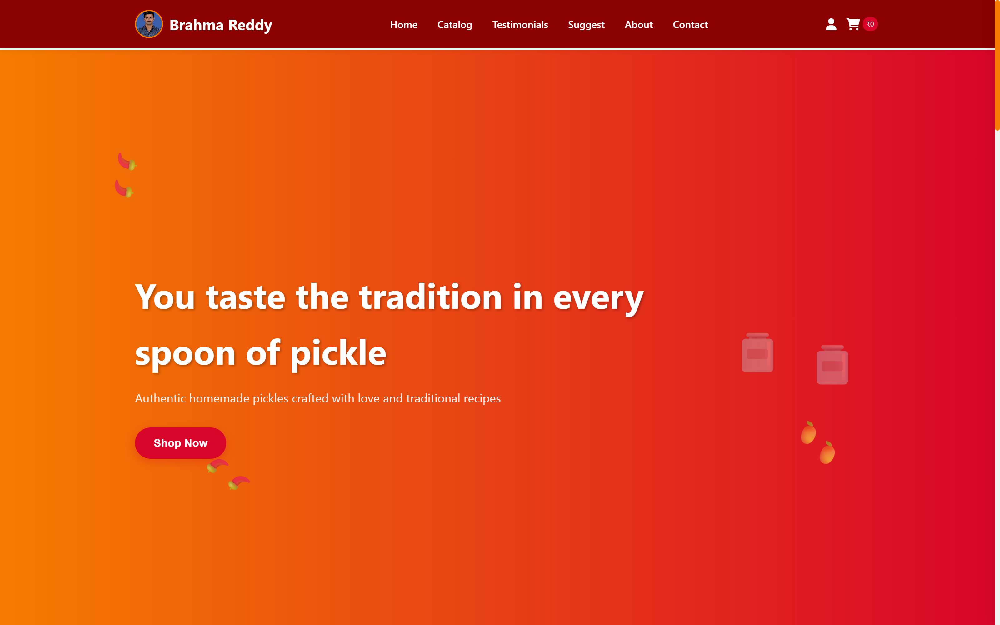

### ⭐ Featured Products Section
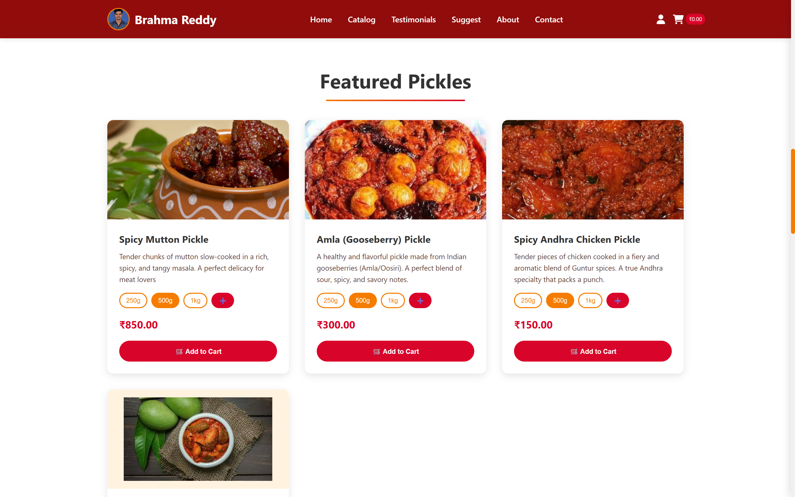

### 📂 Catalog Page
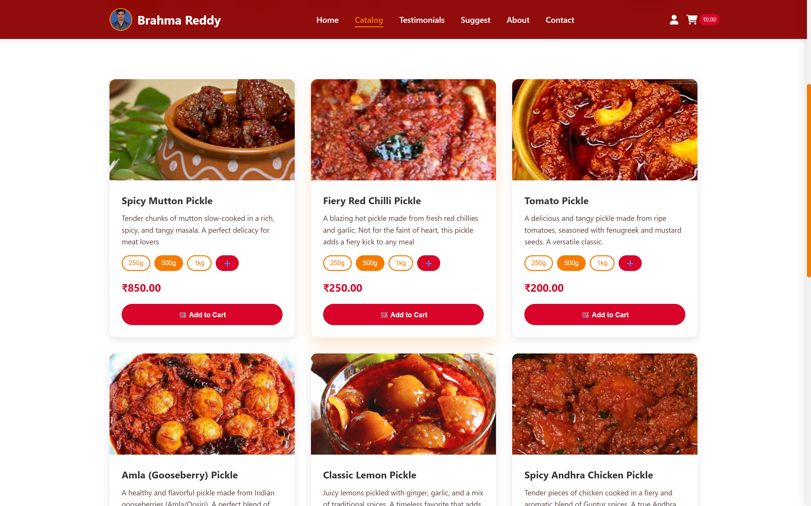

### 🛒 Cart Page
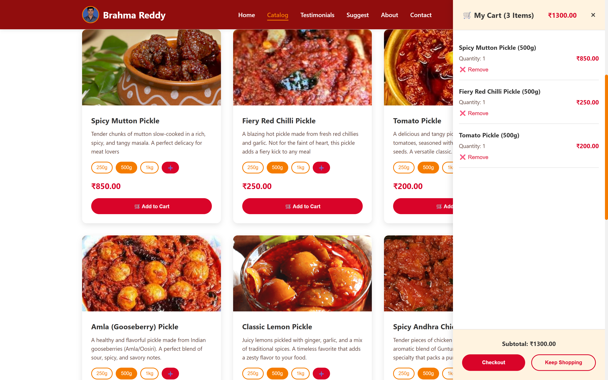

### 👤 My Profile Page
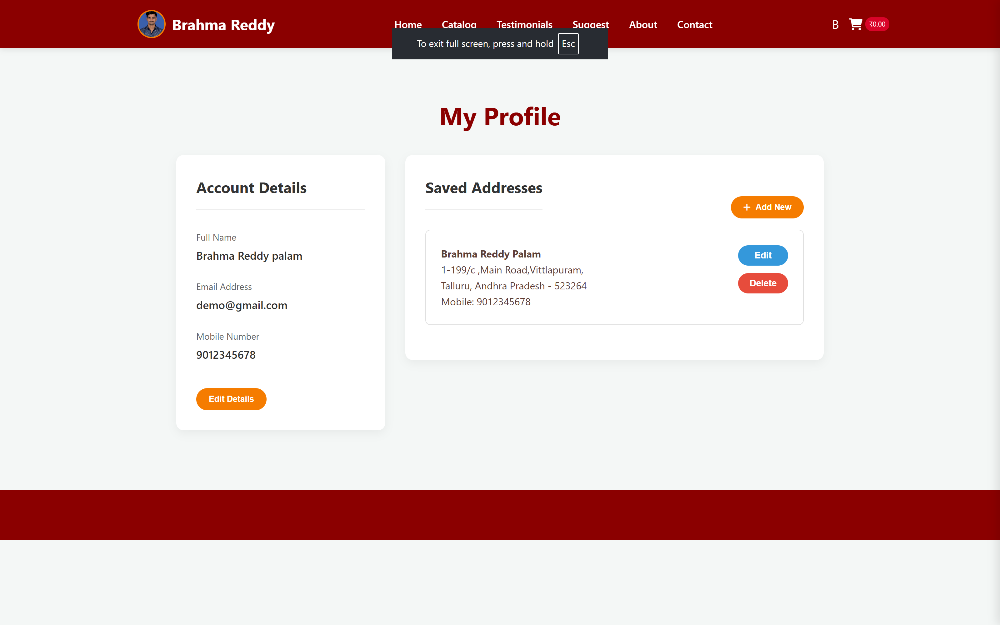

### 📑 My Orders Page
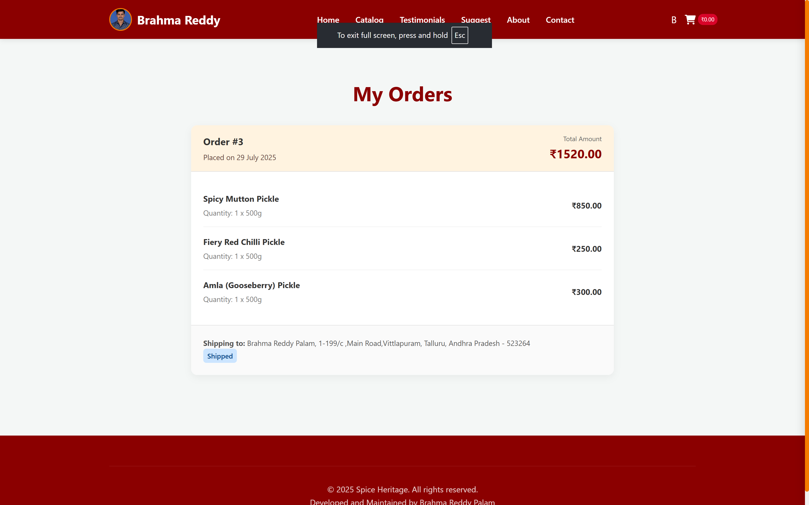
### 🛒 Checckout Page
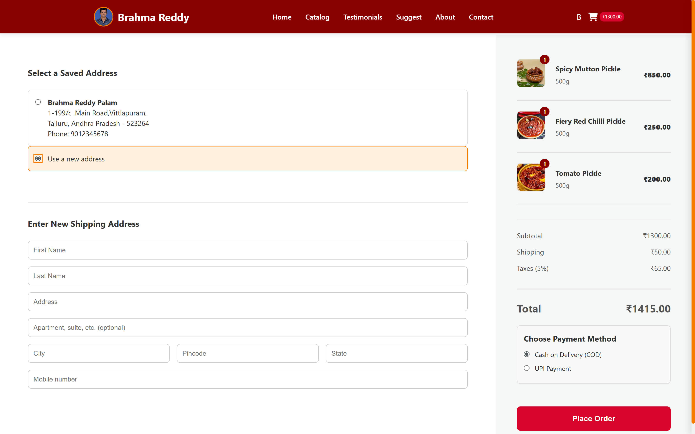

### 🏠 Admin Home / Dashboard
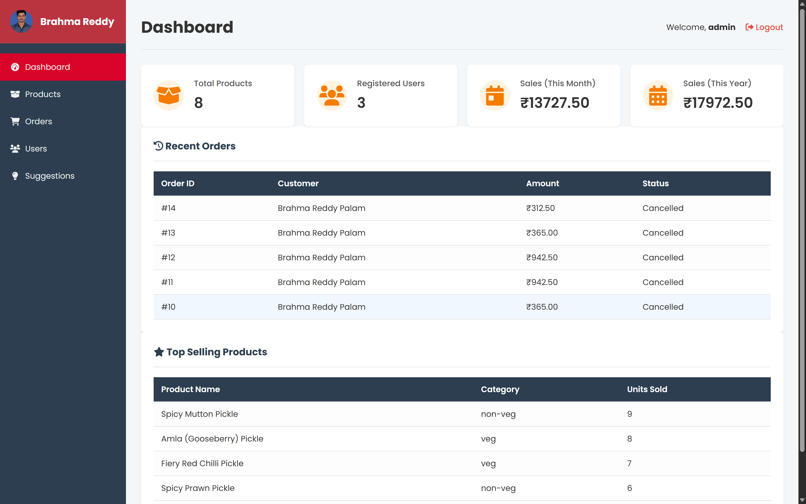

### 📦 Products Management Page
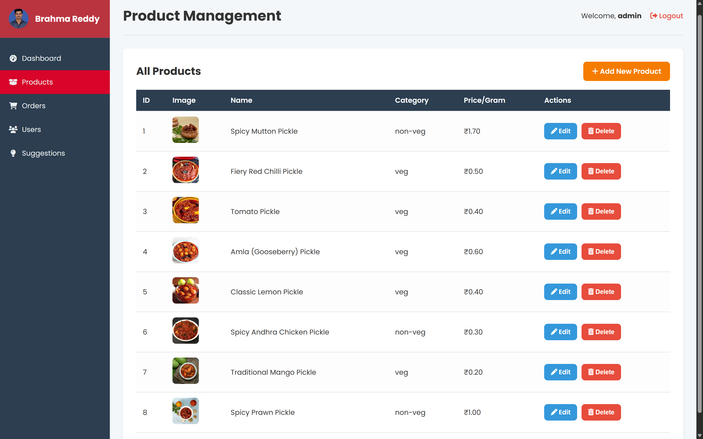

### 👥 Users Management Page
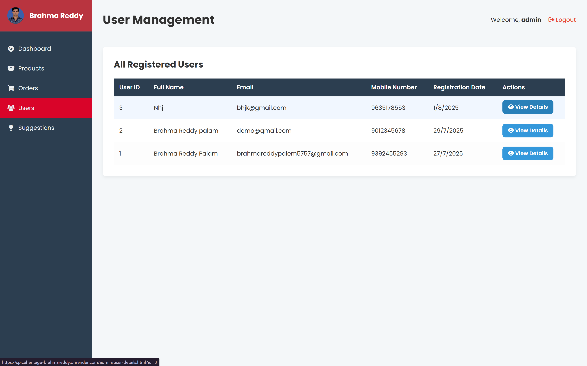
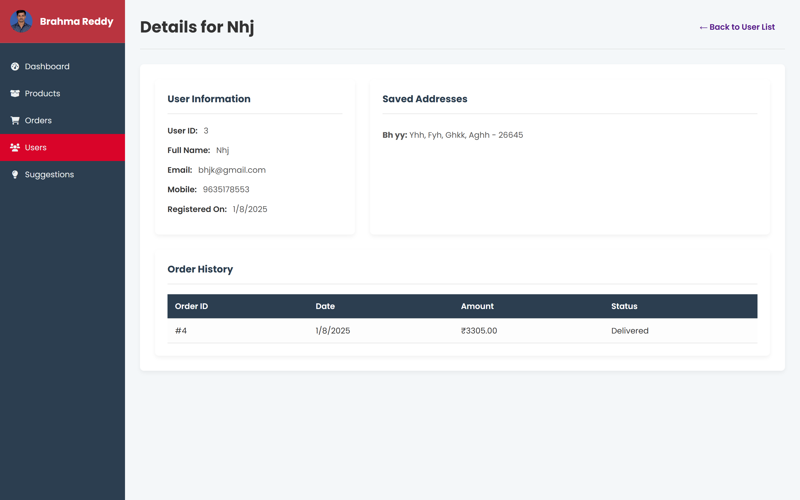

### 🛒 Orders Management Page
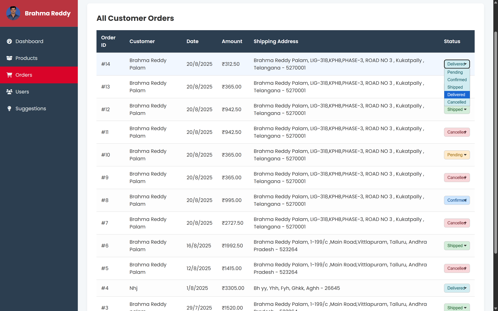


## ⚙️ Setup Installation
  ### 1️⃣ Clone the Repository
    - git clone https://github.com/brahma2242p/spiceheritage-BrahmaReddy.git
    - cd spiceheritage-BrahmaReddy
  ### 2️⃣ Add Required JAR Files

  - Place the following JAR files in your project lib/ folder (or classpath):

  - gson-2.8.9.jar → For JSON parsing

  - jbcrypt-0.4.jar → For password hashing

  - postgresql-42.7.6.jar → PostgreSQL database driver

  - jakarta.servlet-api-6.0.0.jar → For Jakarta Servlets support

  - These libraries are necessary for the backend to compile and run properly.
  ### 3️⃣ Set Environment Variables

  - Set the following environment variables for your database connection:

  - # Windows CMD
  - set DB_URL=jdbc:postgresql://localhost:5432/your_database_name
  - set DB_USER=your_db_user
  - set DB_PASSWORD=your_db_password

  - # Linux / Mac
  - export DB_URL=jdbc:postgresql://localhost:5432/spiceheritage
  - export DB_USER=your_db_user
  - export DB_PASSWORD=your_db_password
  - The project will read these variables to connect to the database dynamically.

  ### 4️⃣ Database Setup

   - PostgreSQL (Recommended):
     - Create a new database in localhost or use render or supabase services
  - Use can use any database you want Oracle,MySQl etc..
  - Create tables based on the above ER-Diagram
  - During Deployment set above environment variables with your own database credentials


  ### 5️⃣ Java & Servlet Setup

  - Make sure Java 17+ is installed.
  
  - Install a servlet container like Apache Tomcat 10+ (supports Jakarta Servlets).
  
  - Build the .war file:
  
  - mvn clean package
  
  
  - Deploy the .war file to Tomcat webapps/ folder.
  
  - Start Tomcat and access

---

## 🤝 Contributing

Contributions, issues, and feature requests are welcome! Feel free to contact.

1.  Fork the repository.
2.  Create your feature branch (`git checkout -b feature/AmazingFeature`).
3.  Commit your changes (`git commit -m 'Add some AmazingFeature'`).
4.  Push to the branch (`git push origin feature/AmazingFeature`).
5.  Open a Pull Request.
6.  If you need full original Source code contact me via LinkedIn or Email
## 📬 Contact

If you have any questions, suggestions, or want to report issues, feel free to reach out:

- **Name:** Brahma Reddy  
- **Email:** brahmareddypalem5757@example.com  
- **GitHub:** [https://github.com/brahma2242p](https://github.com/brahma2242p)  
- **LinkedIn:** [https://www.linkedin.com/in/brahma2242](https://www.linkedin.com/in/brahma2242)  

You can also open issues or pull requests directly on this GitHub repository.


